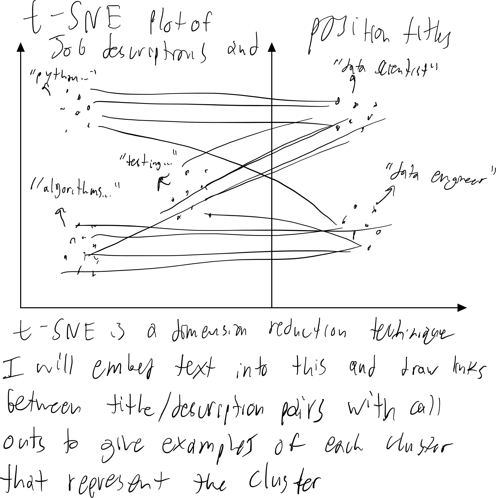
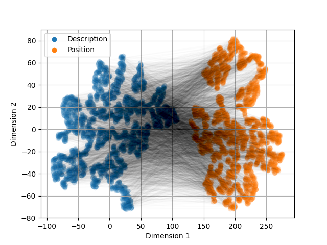

# Data Visualization Project

## Data

For those who are actively looking for data scientist jobs in the U.S., the best news this month is the LinkedIn Workforce Report August 2018. According to the report, there is a shortage of 151,717 people with data science skills, with particularly acute shortages in New York City, San Francisco Bay Area and Los Angeles. To help job hunters to better understand the job market, Shanshan Lu scraped Indeed website and collected information of 7,000 data scientist jobs around the U.S. on August 3rd. The information that he collected are: Company Name, Position Name, Location, Job Description, and Number of Reviews of the Company.

https://www.kaggle.com/sl6149/data-scientist-job-market-in-the-us

## Questions & Tasks

I am on schedule to graduate with a PhD in EE this December and I've begun applying to machine learning jobs. Something that has confused me a bit is how many different titles exist for very similar jobs (i.e., data/ML/AI... combined with analyst/scientist/engineer/researcher/...).

Given Kaggle's active communitty, a number of coding repos are available that ask the following questions already, including https://www.kaggle.com/kambojharyana/exploration-data-scientist-job-market:

 * Who gets hired? What kind of talent do employers want when they are hiring a data scientist?
 * Which location has the most opportunities?
 * What skills, tools, degrees or majors do employers want the most for data scientists?
 * What's the difference between data scientist, data engineer and data analyst?
 * Can you develop an efficient classification algorithm to differentiate the three job types above?

https://www.kaggle.com/carriech/data-scientist-job-market-u-s-data-viz:

 * What position names are the most common?
 * What locations have the most jobs?
 * What companies have the most jobs?

https://www.kaggle.com/garyongguanjie/minjobqualification:

 * What is the minimum education level required for different positions?

While the classifier repo achieved a ~77% classification precision using job descriptions to classify position name, they didn't perform an analysis on that relationship revealing what positions require what responsabilities/requirements/whatever else is included in a description. My research questions for this data vis project are:
* What position(s) are right for me, my skills, and my experience?
* How strong are these correlations between description and position name?
* How strongly do actual job listings match online definitions for these roles?

Googling the most common job positions, here are their definitions. How well do actual job listings adhear to these definitions?:

 * Associate data scientist: The Associate Data Scientist is responsible for collecting, interpreting, and publishing data to guide business decisions. Candidate must have ability to perform cleaning, transforming, and structuring of multiple disparate data sources using tools such as Python or R.
 * Data scientist: Data scientists work closely with business stakeholders to understand their goals and determine how data can be used to achieve those goals. They design data modeling processes, create algorithms and predictive models to extract the data the business needs, and help analyze the data and share insights with peers.
 * Senior data scientist: The Senior Data Scientist oversees the activities of the junior data scientists and provides advanced expertise on statistical and mathematical concepts for the broader Data and Analytics department. The Senior Data Scientist applies and inspires the adoption of advanced data science and analytics across the business.
 * Principal data scientist: The Principal Data Scientist is responsible for creating high-impact Data Science projects. In close coordination with stakeholders, she is responsible for leading a potentially cross-functional team in providing the best solution to a given problem. Hence, her leadership skills have developed since Level 1.0 and 2.0
 * Lead data scientist: Lead Data Scientist responsibilities include managing the data science team, planning projects and building analytics models. ... Your ultimate goal will be to help improve our products and business decisions by making the most out of our data.
 * Data analyst: The data analyst serves as a gatekeeper for an organization's data so stakeholders can understand data and use it to make strategic business decisions. It is a technical role that requires an undergraduate degree or master's degree in analytics, computer modeling, science, or math.
 * Quantitative analyst: A quantitative analyst or “quant” is a specialist who applies mathematical and statistical methods to financial and risk management problems. S/he develops and implements complex models used by firms to make financial and business decisions about issues such as investments, pricing and so on.
 * Research analyst: A research analyst is a professional who prepares investigative reports on securities or assets for in-house or client use. The report an analyst prepares entails the examination of public records of securities of companies or industries, and often concludes with a "buy," "sell," or "hold" recommendation.
 * Data engineer: Data engineers are responsible for finding trends in data sets and developing algorithms to help make raw data more useful to the enterprise. This IT role requires a significant set of technical skills, including a deep knowledge of SQL database design and multiple programming languages.
 * Machine learning engineer: Machine learning engineers develop self-running AI software to automate predictive models for recommended searches, virtual assistants, translation apps, chatbots, and driverless cars. They design machine learning systems, apply algorithms to generate accurate predictions, and resolve data set problems.
 * Research scientist: A research scientist plans and performs experiments. in a wide range of areas, from medical research to. natural sciences to computer science and much. more. Research scientists work in many different.
 * Software engineer: Software engineers draw on their knowledge of engineering, computer science, and math to write, edit, test, and debug programs. Tasks vary depending on the nature of the role but may include: ... Analyzing and designing full software systems. Using design documentation and flowcharts to illustrate what needs to happen.

## Sketches

I’ve created a sketch of this data. I want to use the Doc2Vec natural language processing algorithm in Python to seperately embed each description and position into a constant length vector of floats. Then, I want to use the t-distributed stochastic neighbor (t-sne) embedding to further reduce the dimension of the Doc2Vec embeddings to 2, such that they may be plotted in a scatter plot. The t-sne embeddings also accomplishes the role of clustering, or separating the population of embeddings into similar subgroups, such that even if I choose a vector length of 2 for Doc2Vec, the visualization will benefit from the t-sne clustering. Finally, I want to connect each position-description pair with a thin black line.

## Prototypes

I've created a prototype of the sketch in Python, shown here.

## Remaining Tasks

 * Firstly, this is not a Python class, so my ultimate visualization will of course have to be using D3/React/one of the javascript languages/APIs we have learned in this course.
 * If I decide to continue with the t-sne visualization, I must add callouts to the clusters that describe a representative data point of that cluster. For instance, a text callout for one of the position clusters that reads "data scientist" or, for descriptions, "SQL experience required"
 * I would like to incorperate the theoretical descriptions of these positions as well, perhaps in a second, seperate figure. I not only want to relate descriptions to positions, but descriptions to descriptions.
